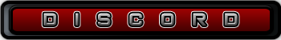

{:discord: style="text-align: center;"}

{: discord}
# Welcome

This page will be a completely khaotic list of tools, articles, and resources I use regularly in Pentesting and CTF situations. My goal is to build this list as often as possible with examples, articles, and useful tips. It will serve as a reference for when I forget things and hopefully will help others to discover tools that they haven't used.

# Discord Logo/Banner Design

Aside from this being a place to get info about pentesting this is also a place to get all of your Discord server needs fulfilled 

* Banner
* Server Buttons
* Emojis
* and any other branding you would like

**View [/GFX-Shop](GFX-Shop) to get more info**
{:log: style="text-align: center;"}

{: log:}

{:pi: style="text-align: right;"}

{: pi}

{:shoutbox: style="text-align: right;"}
<iframe src="https://logicbomb.ishoutbox.com" width="275" height="570" frameborder="0" allowtransparency="true"></iframe>
{: shoutbox}